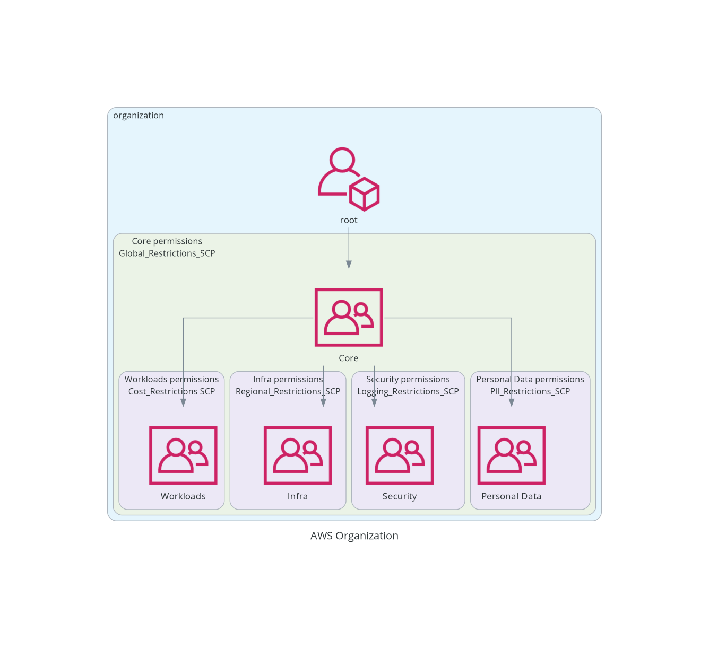

<h1 align="center">
  <br>
  
  <br>
  AWS Organization Diagram
  <br>
</h1>

<h4 align="center">A repo that helps you gain clarity 🔮 on your AWS Organization by diagramming it. The diagram shows org structure and applied SCPs to each OU.</h4>

<p align="center">
  <a href="#how-to-use">How to Use</a> •
  <a href="#libraries">Libraries</a>
</p>

## How to Use

1. clone the repo
2. inside the repo directory run the following

```bash
docker build . -t aws-org-diagram
docker run -it -v $(pwd):/app -w /app aws-org-diagram /bin/bash
``

1. Inside container, configure aws credentials. If you are using it on lambda or batch, boto3 will use the roles attached to the compute. I paste an sts token into the environment from the AWS access portal when running locally. These credentials need to be for the payer account or account that has your Organization defined.

4.execute the script

```bash
python main.py
```

5. the script will output an `aws_organization.png` to the local directory you mounted to /app in the docker run command.


## Libraries

The awesome lib used for diagramming - [Diagrams](https://diagrams.mingrammer.com/)!
